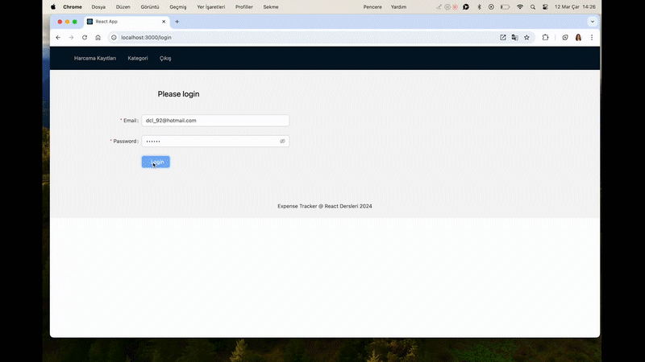

# 💰 Expense Tracker React Firebase Project

<li>This project helps users to keep track of their expenses and incomes.</li>
<li>It is built with modern web technologies and includes functions such as adding and listing expense records.</li>

## 🚀 Features

📩 SignUp : Users can quickly register for an account and login.

📊 Expense Details: Users can create an expense record by adding name, amount and selecting category. Users can create categories by adding name and selecting specified color. Users can view the list of records, edit and delete records.

📱 Responsive Design: With a mobile compatible and stylish design, it can be used easily on any device.

### 🧑‍💻 Technologies Used

<li>React</li>
<li>React-Redux</li>
<li>Firebase</li>
<li>React-router-dom</li>
<li>antd</li>
<li>@ant-design/icons</li>

### 🎥 `Screen`

# Expense-Tracker-React-Firebase-Project
